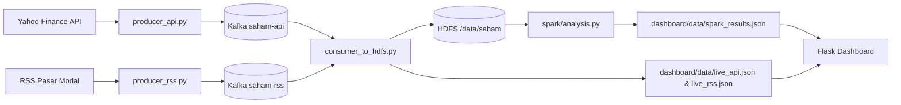

# Kelompok 4 ETS Big Data

## SahamMeter: Monitor Saham IDX & Berita Pasar Modal

Repository ini berisi pipeline end-to-end untuk topik 4 ETS Big Data. Arsitektur yang dipakai mengikuti rubrik penilaian: Kafka sebagai ingestion layer, HDFS sebagai storage layer, Spark sebagai processing layer, dan Flask dashboard sebagai serving layer.

### Anggota Kelompok

- `[Nama Anggota 1]` - Setup Docker, Kafka, dan HDFS
- `[Nama Anggota 2]` - Producer API saham
- `[Nama Anggota 3]` - Producer RSS dan consumer ke HDFS
- `[Nama Anggota 4]` - Spark analysis
- `[Nama Anggota 5]` - Dashboard Flask

### Justifikasi Topik

Topik saham cocok untuk demonstrasi pipeline karena datanya berubah secara berkala, punya konteks bisnis yang jelas, dan mudah ditampilkan dalam dashboard monitoring. Kombinasi harga harian dan berita pasar modal juga membuat analisis Spark lebih bermakna karena bisa menghubungkan pergerakan harga dengan sentimen berita.

### Diagram Arsitektur



### Struktur Utama

- `kafka/producer_api.py`: producer harga saham IDX dari Yahoo Finance via `yfinance`
- `kafka/producer_rss.py`: producer RSS pasar modal dari Bisnis/CNN Indonesia
- `kafka/consumer_to_hdfs.py`: consumer Kafka yang menulis JSON ke HDFS dan salinan lokal dashboard
- `spark/analysis.py`: job Spark untuk 3 analisis wajib topik saham
- `dashboard/app.py`: aplikasi Flask dengan endpoint JSON dan panel monitoring

### Cara Menjalankan (Walkthrough)

Ikuti langkah di bawah dari direktori proyek. Perintah dapat dijalankan di beberapa terminal terpisah.
Jika hanya ingin demo lokal, HDFS bisa di-skip dan consumer tetap berjalan dengan mode local-first.

1. Buat virtual environment dan pasang dependensi

```bash
uv sync
source .venv/bin/activate
```

2. Jalankan Hadoop (Namenode + Datanode + YARN)

```bash
docker compose -f docker-compose-hadoop.yaml up -d
```

Periksa web UI Namenode: http://localhost:9870. Langkah ini opsional kalau Anda hanya ingin demo lokal tanpa menulis ke HDFS.

3. Jalankan Kafka broker

```bash
docker compose -f docker-compose-kafka.yaml up -d
```

Broker tersedia di `localhost:9092` (container name: `kafka-broker`).

4. Buat topic Kafka (jalankan dari host)

```bash
docker exec -it kafka-broker /opt/kafka/bin/kafka-topics.sh --create --bootstrap-server localhost:9092 --replication-factor 1 --partitions 1 --topic saham-api
docker exec -it kafka-broker /opt/kafka/bin/kafka-topics.sh --create --bootstrap-server localhost:9092 --replication-factor 1 --partitions 1 --topic saham-rss
# verifikasi
docker exec -it kafka-broker /opt/kafka/bin/kafka-topics.sh --bootstrap-server localhost:9092 --list
```

5. Jalankan consumer (menulis ke HDFS atau fallback ke `dashboard/data`)

```bash
python kafka/consumer_to_hdfs.py
```

 Secara default consumer berjalan local-first: file `dashboard/data/live_api.json` dan `dashboard/data/live_rss.json` akan terus diperbarui agar dashboard langsung menampilkan data. Jika ingin menulis ke HDFS juga, jalankan dengan:

```bash
ENABLE_HDFS_REMOTE=1 python kafka/consumer_to_hdfs.py
```

 Gunakan mode HDFS hanya jika host/container Anda memang bisa menjangkau NameNode dan DataNode. Buffer consumer di-flush kira-kira setiap 3 menit, masih masuk rentang 2-5 menit sesuai rubrik.

6. Jalankan producers (masing-masing di terminal terpisah)

API producer:

```bash
python kafka/producer_api.py
```

RSS producer:

```bash
python kafka/producer_rss.py
```

7. Jalankan analisis Spark (manual atau via `spark-submit`)

```bash
python spark/analysis.py
# atau jika ingin menggunakan spark-submit:
# spark-submit spark/analysis.py
```

 Script membaca dari HDFS (`/data/saham/api`, `/data/saham/rss`) dan fallback ke `dashboard/data/live_api.json` serta `dashboard/data/live_rss.json` bila HDFS tidak tersedia.
Kalau hanya ingin dashboard live tanpa analisis Spark, langkah ini boleh dilewati sementara.

8. Jalankan dashboard Flask

```bash
python dashboard/app.py
```

Buka: http://localhost:5000
Dashboard akan menampilkan data live begitu consumer dan producers sudah berjalan, walau Spark belum dijalankan.

9. Verifikasi cepat

```bash
curl http://localhost:5000/api/data | jq .
docker exec -it hadoop-namenode hdfs dfs -ls /data || docker exec -it hadoop-namenode hdfs dfs -ls /
docker logs -f kafka-broker
```

Troubleshooting singkat

- Jika `kafka-topics.sh` tidak ada di PATH container, cari di `/opt/kafka/bin/` dan jalankan langsung.
- Jika consumer dijalankan dari host, biarkan `ENABLE_HDFS_REMOTE` tidak diset. Mode local-first akan menyimpan snapshot ke `dashboard/data/` dan dashboard tetap menampilkan data.
- Jika ingin HDFS dari host, Anda harus memastikan NameNode/DataNode benar-benar bisa diakses dari host. Kalau tidak, gunakan mode local-first.
- API producer polling default: 60 detik.
- RSS producer polling default: 300 detik.
- Consumer flush default: 180 detik.
- Gunakan beberapa terminal atau `tmux`/`screen` untuk menjalankan services secara paralel.

Jika mau, saya bisa membuat satu skrip `run-all.sh` untuk menjalankan service Python di background atau dockerize service Python menjadi container orchestrated oleh compose.

### Output yang Dihasilkan

- Data API terkini disimpan ke Kafka topic `saham-api`.
- Artikel RSS disimpan ke Kafka topic `saham-rss`.
- Snapshot data tersimpan ke HDFS pada `/data/saham/api/` dan `/data/saham/rss/` jika `ENABLE_HDFS_REMOTE=1`, dan selalu disalin ke `dashboard/data/live_api.json` serta `dashboard/data/live_rss.json`.
- API producer mengirim data setiap 60 detik.
- RSS producer mengirim data baru setiap 300 detik.
- Consumer menggabungkan buffer dan flush ke HDFS setiap 180 detik.
- Hasil Spark tersimpan ke `/data/saham/hasil/` dan `dashboard/data/spark_results.json`.
- Dashboard membaca `dashboard/data/spark_results.json`, `dashboard/data/live_api.json`, dan `dashboard/data/live_rss.json`.

### Bukti yang Perlu Ditambahkan Saat Demo

- Screenshot HDFS Web UI `localhost:9870`
- Screenshot Kafka consumer output
- Screenshot dashboard `localhost:5000`

### Tantangan dan Solusi

- Rate limit API saham: gunakan fallback simulator saat data real tidak dapat diambil.
- RSS duplikat: simpan ID artikel yang sudah dikirim.
- HDFS tidak tersedia saat demo lokal: consumer dan Spark menyimpan salinan lokal agar dashboard tetap tampil.
- Nama file sinkron dengan dashboard: consumer menulis `live_api.json` dan `live_rss.json`, sementara Spark menulis `spark_results.json`.

### Catatan Implementasi

- Struktur data dibuat konsisten agar Spark membaca field saham dan RSS langsung dari HDFS.
- Dashboard memakai auto-refresh 30 detik untuk menampilkan data yang terus berubah.
- Dashboard menampilkan chart berbasis data Spark menggunakan Chart.js.
- Consumer menulis ke HDFS langsung lewat library `hdfs` Python saat `ENABLE_HDFS_REMOTE=1`.
