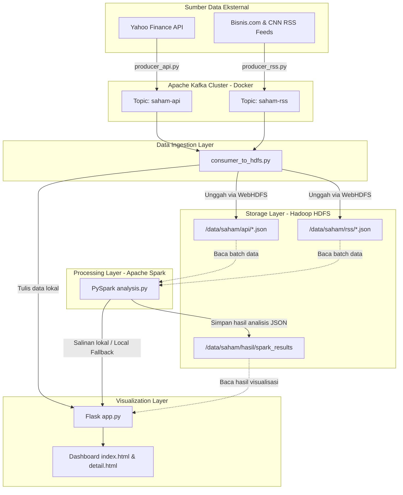
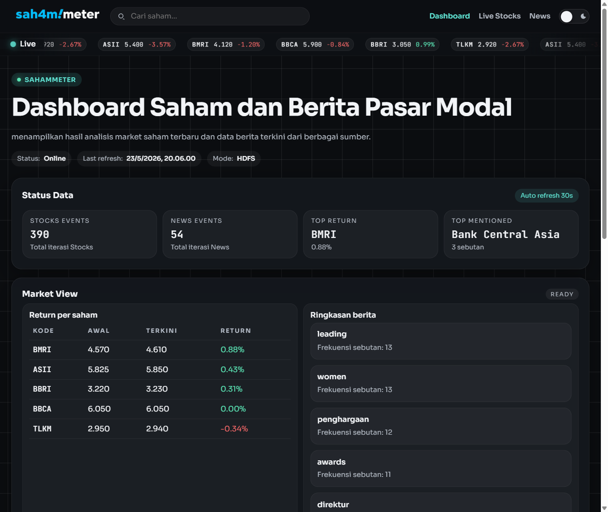
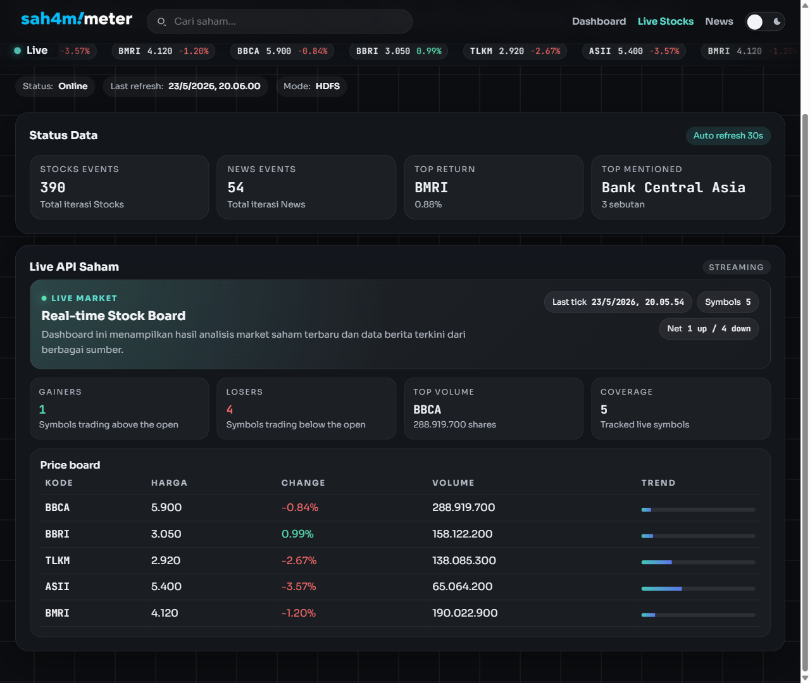
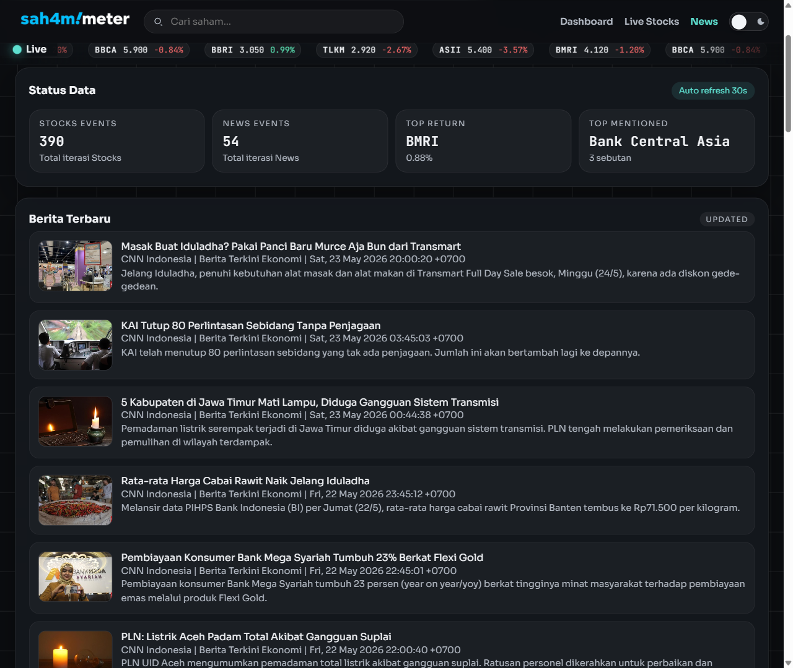
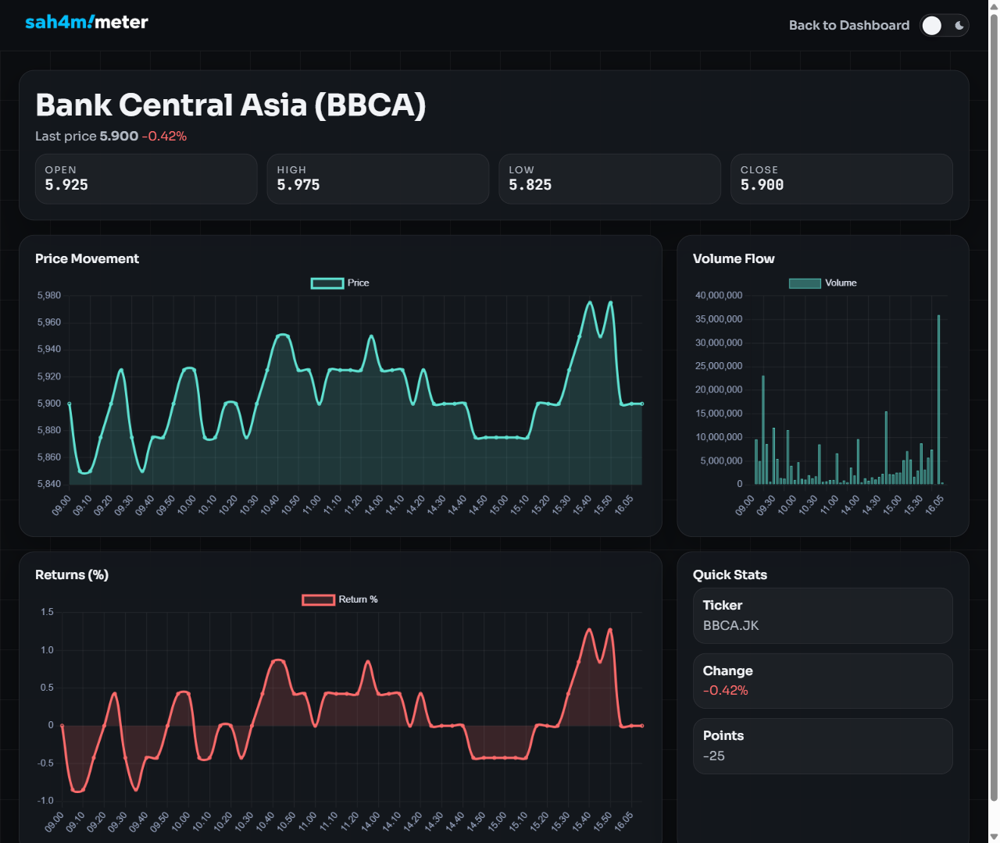

# Laporan Proyek SahamMeter: Big Data Pipeline & Dashboard Analisis Saham

Laporan resmi dan dokumentasi lengkap mengenai arsitektur, fitur, panduan instalasi, serta penggunaan aplikasi **SahamMeter**, sebuah pipeline data berbasis *Big Data* yang mengintegrasikan Apache Kafka, Hadoop HDFS, Apache Spark, dan Web Dashboard interaktif.

---

## Daftar Isi

1. [Deskripsi Proyek & Arsitektur Sistem](#1-deskripsi-proyek--arsitektur-sistem)
   - [Diagram Aliran Data](#diagram-aliran-data)
2. [Penjelasan Detail Komponen & Fitur](#2-penjelasan-detail-komponen--fitur)
   - [2.1 Infrastruktur Docker (Hadoop & Kafka) & Referensi Port](#21-infrastruktur-docker-hadoop--kafka--referensi-port)
   - [2.2 Kafka Producers (Data Ingestion) & Skema Data](#22-kafka-producers-data-ingestion--skema-data)
   - [2.3 Kafka Consumer (Data Persistence)](#23-kafka-consumer-data-persistence)
   - [2.4 PySpark Analytics Engine (Logika Komputasi & Pemrosesan)](#24-pyspark-analytics-engine-logika-komputasi--pemrosesan)
   - [2.5 Web Dashboard & Visualisasi Interaktif](#25-web-dashboard--visualisasi-interaktif)
3. [Panduan Instalasi & Cara Menjalankan](#3-panduan-instalasi--cara-menjalankan)
   - [3.1 Prasyarat Sistem](#31-prasyarat-sistem)
   - [3.2 Langkah 1: Kloning & Pengaturan Lingkungan Python](#32-langkah-1-kloning--pengaturan-lingkungan-python)
   - [3.3 Langkah 2: Menjalankan Infrastruktur Docker](#33-langkah-2-menjalankan-infrastruktur-docker)
   - [3.4 Langkah 3: Menjalankan Data Ingestion (Kafka Producers & Consumer)](#34-langkah-3-menjalankan-data-ingestion-kafka-producers--consumer)
   - [3.5 Langkah 4: Menjalankan Analisis PySpark](#35-langkah-4-menjalankan-analisis-pyspark)
   - [3.6 Langkah 5: Menjalankan Web Dashboard](#36-langkah-5-menjalankan-web-dashboard)
   - [3.7 Menghentikan Layanan (Teardown)](#37-menghentikan-layanan-teardown)
4. [Tampilan Antarmuka & Laporan Dashboard](#4-tampilan-antarmuka--laporan-dashboard)
   - [4.1 Halaman Dashboard Utama (Market View)](#41-halaman-dashboard-utama-market-view)
   - [4.2 Halaman Live Stocks (Live API Saham)](#42-halaman-live-stocks-live-api-saham)
   - [4.3 Halaman News (Berita Terbaru)](#43-halaman-news-berita-terbaru)
   - [4.4 Halaman Detail Saham (Stock Detail - BBCA)](#44-halaman-detail-saham-stock-detail---bbca)
5. [Kesimpulan & Analisis Aliran Data](#5-kesimpulan--analisis-aliran-data)
6. [Panduan Troubleshooting & FAQ](#6-panduan-troubleshooting--faq)

---

## 1. Deskripsi Proyek & Arsitektur Sistem

**SahamMeter** adalah sebuah platform pemantauan dan analisis saham real-time yang dirancang khusus untuk memproses data berkapasitas besar (*Big Data*). Sistem ini mengintegrasikan data pergerakan harga saham dari pasar modal Indonesia (khususnya 5 emiten besar: **BBCA, BBRI, TLKM, ASII, BMRI**) dengan berita pasar modal terbaru dari portal berita terkemuka seperti Bisnis.com dan CNN Indonesia.

Sistem dirancang dengan arsitektur toleransi kesalahan (*fault-tolerant*) dan kemampuan pemrosesan terdistribusi:

- **Penyimpanan Terdistribusi**: Menggunakan Hadoop HDFS untuk menyimpan data historis secara terstruktur dan andal.
- **Message Broker Terdistribusi**: Menggunakan Apache Kafka untuk mengalirkan data (*streaming data*) dengan latensi rendah dari berbagai sumber eksternal.
- **Komputasi Terdistribusi**: Menggunakan Apache Spark (PySpark) untuk melakukan analisis agregasi, perhitungan *returns*, volatilitas intraday, analisis tren kata pada berita, serta mendeteksi emiten yang paling sering disebut.

### Diagram Aliran Data

Berikut adalah visualisasi alur perpindahan data dari sumber eksternal hingga disajikan pada layar pengguna:



---

## 2. Penjelasan Detail Komponen & Fitur

### 2.1 Infrastruktur Docker (Hadoop & Kafka) & Referensi Port

Layanan dijalankan menggunakan Docker Compose yang dibagi menjadi dua kluster independen:

- **Hadoop Cluster (`docker-compose-hadoop.yaml`)**:
  - `namenode`: Pengatur metadata HDFS dan direktori kerja.
  - `datanode`: Tempat penyimpanan blok data fisik HDFS.
  - `resourcemanager` & `nodemanager`: Manajemen sumber daya YARN untuk penjadwalan komputasi.
- **Kafka Cluster (`docker-compose-kafka.yaml`)**:
  - `kafka`: Broker tunggal menggunakan mode KRaft versi Apache Kafka 3.9.0 untuk menyalurkan pesan bertipe pub/sub.

Berikut tabel acuan port host yang diekspos oleh kontainer-kontainer di atas:

| Layanan | Kontainer | Port Host | Deskripsi | URL Akses |
| :--- | :--- | :---: | :--- | :--- |
| **Hadoop NameNode UI** | `hadoop-namenode` | `9870` | HDFS Explorer & Status Cluster | [http://localhost:9870](http://localhost:9870) |
| **Hadoop NameNode RPC** | `hadoop-namenode` | `8020` | Port Komunikasi IPC Hadoop | `hdfs://localhost:8020` |
| **Hadoop DataNode UI** | `hadoop-datanode` | `9864` | Status DataNode | [http://localhost:9864](http://localhost:9864) |
| **YARN ResourceManager UI** | `hadoop-resourcemanager` | `8088` | Monitor Job/Aplikasi Hadoop | [http://localhost:8088](http://localhost:8088) |
| **YARN NodeManager UI** | `hadoop-nodemanager` | `8042` | Status Node Kontainer YARN | [http://localhost:8042](http://localhost:8042) |
| **Kafka Broker** | `kafka-broker` | `9092` | Broker Kafka (PLAINTEXT) | `localhost:9092` |
| **Flask Web App** | *(host)* | `5000` | Server Web Dashboard SahamMeter | [http://localhost:5000](http://localhost:5000) |

### 2.2 Kafka Producers (Data Ingestion) & Skema Data

Ada dua produsen data yang berjalan secara asinkron di folder [`kafka/`](kafka/):

**1. Produsen Saham (`producer_api.py`)**

Mengunduh harga saham terbaru dari Yahoo Finance (`yfinance`) untuk emiten **BBCA.JK, BBRI.JK, TLKM.JK, ASII.JK, dan BMRI.JK** setiap 60 detik. Jika pasar tutup atau koneksi API gagal, secara otomatis beralih ke algoritma simulasi fluktuasi acak.

Skema JSON yang diproduksi ke topik `saham-api`:

```json
{
  "symbol": "BBCA",
  "ticker": "BBCA.JK",
  "company_name": "Bank Central Asia",
  "price_current": 10250.00,
  "price_open": 10200.00,
  "price_high": 10300.00,
  "price_low": 10175.00,
  "volume": 3245600,
  "previous_close": 10225.00,
  "change_24h_pct": 0.2445,
  "source": "yfinance",
  "timestamp": "2026-05-23T13:00:00.000Z"
}
```

**2. Produsen Berita (`producer_rss.py`)**

Memindai umpan RSS Bisnis.com dan CNN Indonesia setiap 300 detik. Menyaring artikel duplikat menggunakan *hash* SHA-1 dari URL yang dicatat pada berkas `.rss_seen_ids.json`.

Skema JSON yang diproduksi ke topik `saham-rss`:

```json
{
  "title": "IHSG Berpeluang Menguat Terhimpit Sentimen Saham BBCA dan BMRI",
  "link": "https://rss.bisnis.com/feed/.../financial-market/12345",
  "summary": "Pasar modal hari ini diprediksi mengalami penguatan tipis dipimpin oleh sektor perbankan...",
  "published": "Sat, 23 May 2026 12:45:00 GMT",
  "source": "Bisnis.com Financial Market",
  "item_id": "a90b8c7d",
  "timestamp": "2026-05-23T13:00:00.000Z"
}
```

### 2.3 Kafka Consumer (Data Persistence)

File [`kafka/consumer_to_hdfs.py`](kafka/consumer_to_hdfs.py) mengelola penyimpanan dengan cara berikut:

- Menjalankan dua *thread* konsumen asinkron untuk topik `saham-api` dan `saham-rss`.
- Setiap kali data masuk, ditambahkan penanda waktu konsumsi (`consumed_at`) dan disimpan ke dalam *buffer* lokal.
- Setiap setelah 1 detik atau buffer terisi penuh (>= 50 items), data dialirkan ke dua tujuan:
  1. **Lokal**: Menyimpan langsung ke berkas `dashboard/data/live_api.json` dan `dashboard/data/live_rss.json` untuk rendering instan.
  2. **HDFS**: Mengunggah berkas JSON snapshot secara dinamis ke direktori HDFS `/data/saham/api` dan `/data/saham/rss` melalui WebHDFS.

> **Mode Toleransi Kegagalan (Local-first)**: Jika kluster Hadoop HDFS tidak aktif, skrip otomatis beralih menggunakan penyimpanan lokal secara penuh tanpa menghentikan pipeline data.

### 2.4 PySpark Analytics Engine (Logika Komputasi & Pemrosesan)

Pusat analitik sistem berada pada skrip [`spark/analysis.py`](spark/analysis.py). Skrip ini dijalankan dalam *loop* tak terbatas (setiap 5 detik) untuk mensimulasikan pemrosesan dekat-nyata (*near real-time*), membaca semua data JSON mentah dari HDFS (atau lokal sebagai cadangan), lalu melakukan kalkulasi analitik berikut:

#### A. Perhitungan Return Saham (Windowing)

Spark mendefinisikan dua jendela partisi berdasarkan kolom waktu asinkron (`timestamp_ts`):

```python
window_asc = Window.partitionBy("symbol").orderBy(
    F.col("timestamp_ts").asc(), F.col("price_current").asc()
)
window_desc = Window.partitionBy("symbol").orderBy(
    F.col("timestamp_ts").desc(), F.col("price_current").desc()
)
```

- **Harga Awal (`price_start`)**: Diambil dari baris pertama (`row_number() == 1`) pada `window_asc`.
- **Harga Terkini (`price_latest`)**: Diambil dari baris pertama (`row_number() == 1`) pada `window_desc`.
- **Rumus Return Kumulatif**:

$$\text{Return} \ (\%) = \frac{\text{price\\_latest} - \text{price\\_start}}{\text{price\\_start}} \times 100$$

#### B. Perhitungan Volatilitas Intraday (Standar Deviasi)

Digunakan untuk mengukur fluktuasi dan tingkat risiko pergerakan harga saham emiten. Spark menghitung standar deviasi populasi dengan rumus:

$$\sigma = \sqrt{\frac{1}{N}\sum_{i=1}^{N}(x_i - \bar{x})^2}$$

Diimplementasikan menggunakan fungsi agregasi bawaan Spark:

```python
F.stddev_pop("price_current").alias("volatility_price_std")
```

#### C. Analisis Berita (Word Trends & RegEx Matching)

- **Tren Kata (Word Cloud)**: Menghapus tanda baca, memecah judul berita menjadi array kata (`split`), mengecualikan *stopwords* umum (seperti "dan", "yang", "untuk"), lalu menghitung frekuensi total kata secara terurut.
- **Top Emiten Disebut (Regex)**: Memindai kecocokan regex nama/singkatan emiten pada kolom judul dan rangkuman berita. Contoh pola untuk BBCA:

```python
term_pattern = r"(?i)(?:\bbca\b|\bbank central asia\b)"
```

### 2.5 Web Dashboard & Visualisasi Interaktif

Dibuat menggunakan Flask ([`dashboard/app.py`](dashboard/app.py)) dengan dua halaman utama:

- **Dashboard Utama (`index.html`)**: Menyajikan visualisasi KPI global (Total Events, Top Return, Top Mentioned), tabel ringkasan return, grafik batang return emiten, line chart pergerakan harga intraday, tag cloud kata kunci berita, volume rasio, dan meteran Market Pulse. Dilengkapi toggle tema gelap/terang, autocomplete pencarian saham, dan auto-refresh asinkron setiap 30 detik.
- **Halaman Detail Saham (`detail.html`)**: Memuat data historis pergerakan intraday interval 5 menit langsung dari Yahoo Finance API, menampilkan grafik pergerakan harga, volume, serta fluktuasi keuntungan harian.

---

## 3. Panduan Instalasi & Cara Menjalankan

### 3.1 Prasyarat Sistem

- **Docker** dan **Docker Compose** telah terinstal.
- **Python >= 3.13** telah terinstal.
- Disarankan menggunakan tool **uv** (pengelola paket Python cepat) atau `pip` standar.
- **Apache Spark** terinstal di lokal untuk menjalankan `analysis.py`.

### 3.2 Langkah 1: Kloning & Pengaturan Lingkungan Python

Buka terminal di direktori proyek dan buat virtual environment:

```bash
# Membuat virtual environment dan memasang dependensi menggunakan 'uv'
uv venv
source .venv/bin/activate
uv pip install -e .
```

> [!NOTE]
> Jika tidak menggunakan `uv`, gunakan perintah bawaan Python:
> ```bash
> python3 -m venv .venv
> source .venv/bin/activate
> pip install -r pyproject.toml
> ```

### 3.3 Langkah 2: Menjalankan Infrastruktur Docker

Jalankan skrip pembantu `up.sh` untuk menyalakan kluster Hadoop dan Kafka secara otomatis, sekaligus menginisialisasi topik Kafka dan folder HDFS:

```bash
chmod +x up.sh down.sh
./up.sh
```

### 3.4 Langkah 3: Menjalankan Data Ingestion (Kafka Producers & Consumer)

Buka terminal baru (pastikan virtual environment aktif) dan jalankan konsumen data sebagai jembatan penyimpanan ke HDFS:

```bash
python kafka/consumer_to_hdfs.py
```

Buka terminal baru untuk menjalankan produsen data saham (Yahoo Finance / Simulasi):

```bash
python kafka/producer_api.py
```

Buka terminal baru untuk menjalankan produsen data berita (RSS Reader / Simulasi):

```bash
python kafka/producer_rss.py
```

### 3.5 Langkah 4: Menjalankan Analisis PySpark

Jalankan skrip analisis untuk memulai pengolahan data mentah yang tersimpan di HDFS:

```bash
python spark/analysis.py
```

### 3.6 Langkah 5: Menjalankan Web Dashboard

Jalankan server Flask untuk menyajikan tampilan grafis interaktif:

```bash
python dashboard/app.py
```

Setelah aktif, buka peramban (*web browser*) dan akses:

```
http://localhost:5000
```

### 3.7 Menghentikan Layanan (Teardown)

Untuk mematikan seluruh infrastruktur Docker dan membersihkan data sementara di direktori proyek:

```bash
./down.sh
```

---

## 4. Tampilan Antarmuka & Laporan Dashboard

### 4.1 Halaman Dashboard Utama (Market View)



Halaman utama **SahamMeter Dashboard** pada tab **Dashboard** merangkum hasil analisis data historis dari Apache Spark. Elemen-elemen yang tersedia:

1. **Ticker Bar Berjalan (Running Ticker)**: Terletak di bagian atas halaman, menampilkan fluktuasi harga saham real-time untuk BBCA, BBRI, TLKM, ASII, dan BMRI lengkap dengan indikator kenaikan (hijau) atau penurunan (merah).
2. **Status Metadata**: Menampilkan waktu refresh terakhir (*last refresh*), status kelancaran penyerapan data, serta mode penyimpanan aktif (**HDFS** atau **Local-first**).
3. **KPI Cards (Status Data)**:
   - **Stocks Events**: Total data transaksi saham yang telah diolah oleh Kafka & Spark.
   - **News Events**: Jumlah artikel berita pasar modal yang telah diproses.
   - **Top Return**: Kode emiten dengan keuntungan persentase harian tertinggi beserta nilainya.
   - **Top Mentioned**: Emiten yang paling sering dibahas di media massa.
4. **Tabel Performa (Return per Saham)**: Memetakan harga pembukaan (*price start*), harga terkini (*price latest*), dan persentase return bersih setiap emiten.
5. **Ringkasan Kata Kunci (News Keywords)**: Daftar kata kunci terpopuler hasil ekstraksi teks Spark SQL.
6. **Grafik Agregasi (Charts)**:
   - **Return per Saham**: Visualisasi batang perbandingan return emiten.
   - **Rata-rata Harga per Jam**: Grafik tren pergerakan harga intraday rata-rata.
   - **Stocks vs News Volume**: Rasio volume data pergerakan pasar dibandingkan berita masuk.
   - **Top Mentioned Company & Market Pulse**: Frekuensi popularitas media emiten dan indikator sentimen pasar.

### 4.2 Halaman Live Stocks (Live API Saham)



Tab **Live Stocks** menampilkan aliran data mentah real-time langsung dari produsen Kafka (`producer_api.py`), sebelum diolah oleh Spark. Informasi yang ditampilkan per emiten meliputi: Harga Terkini, Harga Pembukaan, Harga Tertinggi, Harga Terendah, Volume Transaksi, Penutupan Sebelumnya, Persentase Perubahan 24 Jam, Sumber Data, serta Penanda Waktu Konsumsi Data.

### 4.3 Halaman News (Berita Terbaru)



Tab **News** menyajikan ringkasan berita terhangat hasil ekstraksi RSS Feeds Bisnis.com dan CNN Indonesia (`producer_rss.py`). Setiap entri berita dilengkapi dengan judul, rangkuman singkat, sumber portal media, tanggal rilis, serta tautan langsung ke artikel selengkapnya. Sistem deduplikasi otomatis menyaring berita berulang agar informasi tetap bersih dan efisien.

### 4.4 Halaman Detail Saham (Stock Detail - BBCA)



Halaman detail saham memvisualisasikan data runtun waktu intraday emiten **BBCA** dengan interval 5 menit. Elemen yang tersedia:

1. **Statistik Utama**: Ringkasan harga pembukaan (*Open*), tertinggi (*High*), terendah (*Low*), dan penutupan (*Close*).
2. **Grafik Runtun Waktu (Time Series)**:
   - **Price Movement**: Grafik pergerakan harga intraday.
   - **Volume Flow**: Distribusi volume transaksi pada setiap interval 5 menit.
   - **Returns (%)**: Akumulasi tingkat keuntungan saham sepanjang hari transaksi.
3. **Bilah Metrik Samping (Quick Stats)**: Menampilkan kode emiten Yahoo Finance (`BBCA.JK`), selisih poin pergerakan, dan data pendukung lainnya.

---

## 5. Kesimpulan & Analisis Aliran Data

Proyek **SahamMeter** membuktikan keandalan integrasi ekosistem *Big Data* dalam menyajikan analitik real-time. Dengan memisahkan proses penyerapan data (*ingestion* via Kafka), penyimpanan (*storage* via Hadoop HDFS), pemrosesan analitik (*processing* via Apache Spark), dan penyajian visual (*presentation* via Flask & Chart.js), sistem ini menjamin:

- **Skalabilitas**: Hadoop dan Kafka siap menangani ratusan emiten tambahan tanpa penurunan performa yang signifikan.
- **Ketahanan Sistem (Fault-tolerance)**: Mekanisme fallback lokal yang diimplementasikan pada konsumen HDFS dan skrip PySpark menjamin aplikasi tetap berjalan normal meskipun salah satu node Hadoop mengalami kegagalan teknis.
- **Keakuratan Keputusan**: Kombinasi metrik finansial keras (harga, return, volatilitas) dengan data lunak sentimen (berita & kata kunci populer) memberikan gambaran pasar yang komprehensif bagi para analis keuangan.

---

## 6. Panduan Troubleshooting & FAQ

### Q1: Muncul error `NameNode is in safe mode` saat inisialisasi folder HDFS (`up.sh`)

**Penyebab**: NameNode Hadoop baru saja dinyalakan dan otomatis memasuki mode baca-saja (*safe mode*) untuk memvalidasi replikasi blok data sebelum siap menerima instruksi tulis.

**Solusi**: Paksa NameNode keluar dari *safe mode* dengan perintah berikut:

```bash
docker exec -it hadoop-namenode hdfs dfsadmin -safemode leave
```

---

### Q2: Flask Dashboard gagal berjalan dengan error `Address already in use` (Port 5000)

**Penyebab**: Port `5000` telah digunakan oleh layanan lain pada komputer host (misalnya layanan *AirPlay Receiver* di macOS atau sesi Flask lama yang menggantung).

**Solusi**: Cari dan hentikan proses yang menempati port 5000:

```bash
# Linux / macOS
kill -9 $(lsof -t -i:5000)
```

Atau edit baris terakhir berkas `dashboard/app.py` untuk mengalihkan ke port alternatif, misalnya `port=5001`.

---

### Q3: Muncul log warning `HDFS upload failed; using local fallback only` pada terminal Consumer

**Penyebab**: Layanan HDFS namenode belum selesai booting sepenuhnya saat konsumen mulai diaktifkan, atau jaringan kontainer terputus.

**Solusi**: Pastikan kontainer docker berjalan normal dengan `docker ps`. Jika kondisi kontainer normal, log ini **dapat diabaikan** — sistem memiliki mekanisme toleransi kesalahan otomatis (*automatic failover*) yang mengalihkan penyimpanan ke repositori lokal tanpa mengganggu kelancaran visualisasi dashboard.