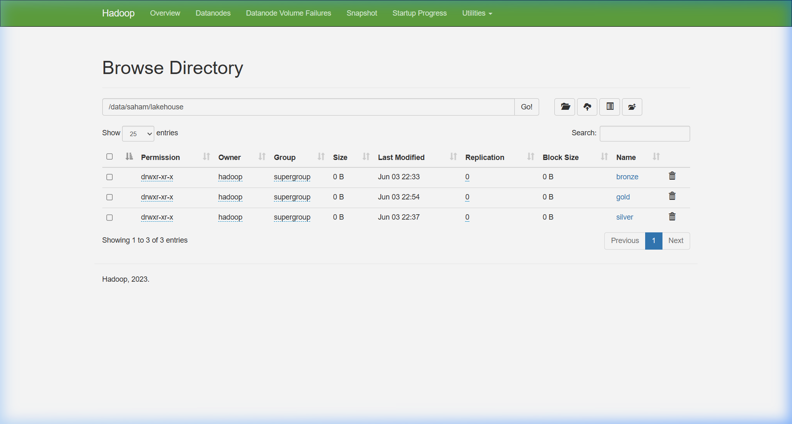
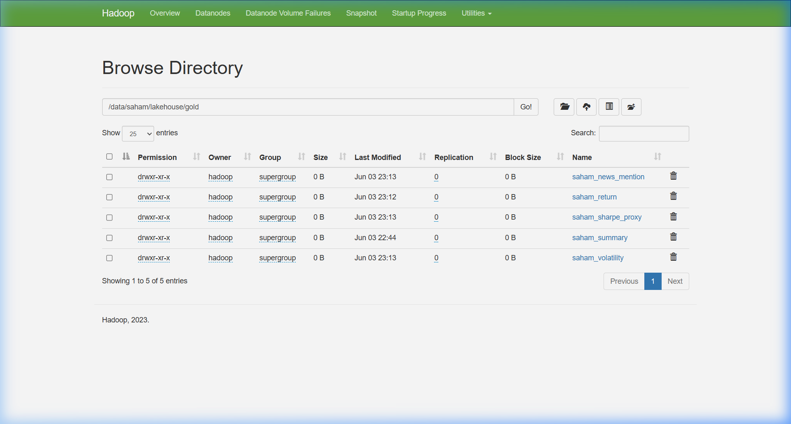
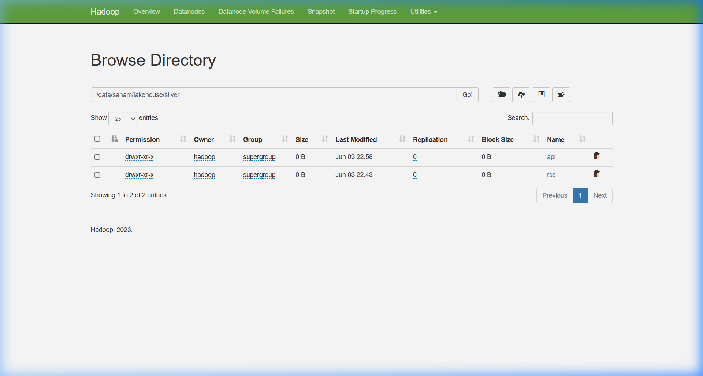
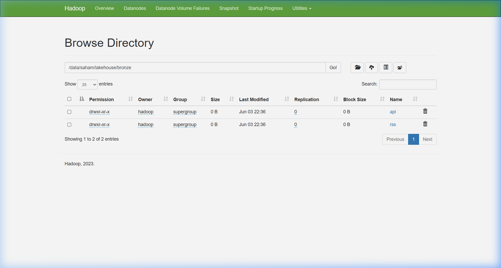

# Lakehouse Pipeline: Topik 4 — SahamMeter

## 1) Diagram Arsitektur — Sebelum vs Sesudah

**Sebelum (ETS lama):**

```text
[API Real-time]  -->  Kafka  -->  Consumer  -->  HDFS (raw JSON)
[RSS Feed]       -->  Kafka  -->  Consumer  -->  HDFS (raw JSON)
                                                       |
                                               Spark analysis.py
                                           (baca JSON mentah, 3 analisis)
                                                       |
                                              Flask Dashboard
```

**Sesudah (dengan Lakehouse — Medallion Architecture):**

```text
[API Real-time]  -->  Kafka  -->  Consumer  -->  HDFS (raw JSON)
[RSS Feed]       -->  Kafka  -->  Consumer  -->  HDFS (raw JSON)
                                                       |
                                              [01_bronze.py]
                                        BRONZE Delta Lake (raw + metadata)
                                     hdfs:///data/saham/lakehouse/bronze/
                                                       |
                                              [02_silver.py]
                                    SILVER Delta Lake (cleaned & typed)
                                     hdfs:///data/saham/lakehouse/silver/
                                                       |
                                              [03_gold.py]
                                  GOLD Delta Lake (aggregated & joined)
                                     hdfs:///data/saham/lakehouse/gold/
                                                       |
                                       Dashboard / Reporting / Analysis
```

---

## 2) Cara Menjalankan Pipeline

> **Prasyarat**: Java 21 wajib digunakan. PySpark 4.0.0 (yang dipakai proyek ini) tidak kompatibel dengan Java versi lebih baru maupun Java 11 ke bawah.

```bash
# Setup lingkungan Java 21
export JAVA_HOME=/usr/lib/jvm/java-21-openjdk-amd64
export PATH="$JAVA_HOME/bin:$PATH"

# Jalankan pipeline secara berurutan dari root repo
.venv/bin/python lakehouse/01_bronze.py
.venv/bin/python lakehouse/02_silver.py
.venv/bin/python lakehouse/03_gold.py

# Demonstrasi Time Travel (opsional, tapi wajib untuk nilai penuh)
.venv/bin/python lakehouse/04_time_travel_demo.py
```

Atau jalankan semua sekaligus:

```bash
export JAVA_HOME=/usr/lib/jvm/java-21-openjdk-amd64 && export PATH="$JAVA_HOME/bin:$PATH" && \
  .venv/bin/python lakehouse/01_bronze.py && \
  .venv/bin/python lakehouse/02_silver.py && \
  .venv/bin/python lakehouse/03_gold.py && \
  .venv/bin/python lakehouse/04_time_travel_demo.py
```

---

## 3) Penjelasan Setiap Transformasi di Silver — Mengapa Dilakukan

### API (Data Harga Saham)

| Transformasi | Kolom | Alasan |
|---|---|---|
| Normalisasi teks | `symbol`, `ticker` → uppercase/trim | Mencegah duplikat semantik (`bbca` vs `BBCA`) saat groupBy/join |
| Cast tipe numerik | `price_current`, `volume`, dll → `double` | Memastikan operasi aritmetika (avg, stddev, return %) akurat |
| Parse timestamp | `timestamp` → `timestamp_ts` (TimestampType) | Memungkinkan window functions, groupBy jam, dan pengurutan temporal |
| Filter nilai invalid | `price_current <= 0`, `volume < 0` | Menghapus placeholder/error values yang mengacaukan perhitungan volatilitas |
| Filter `price_high >= price_low` | Validasi logis harga | Menghapus data rusak dari API yang melaporkan high < low |
| Drop duplicates | `symbol + ticker + timestamp_ts` | Mencegah double-counting akibat consumer mengirim ulang pesan Kafka |

### RSS (Data Berita Saham)

| Transformasi | Kolom | Alasan |
|---|---|---|
| Trim teks | `title`, `link`, `item_id`, `summary` | Konsistensi dan memudahkan deduplikasi |
| Parse timestamp | `timestamp` → `timestamp_ts`, `published` → `published_ts` | Analisis temporal berita (frekuensi per jam) |
| Filter wajib | `item_id`, `title`, `link` tidak null | Menghapus berita tanpa identitas yang tidak bisa didedup |
| Drop duplicates | `item_id + link + timestamp_ts` | Consumer RSS bisa mengambil artikel yang sama berulang kali |

---

## 4) Statistik Data Loss setelah Cleaning (Bronze → Silver)

Berikut angka aktual dari eksekusi pipeline pada dataset yang tersedia:

### API (Harga Saham)
| Tahap | Jumlah Baris | Hilang |
|---|---|---|
| Bronze (raw) | **165 rows** | — |
| Setelah filter timestamp valid | ~165 | ~0 (semua punya timestamp) |
| Setelah filter harga & volume valid | ~165 | ~0 (tidak ada harga negatif) |
| Setelah drop duplicates | **90 rows** | **75 rows (45.5%)** |
| **Silver (final)** | **90 rows** | **75 rows hilang total** |

> **Interpretasi API**: 45% data hilang murni karena deduplikasi, membuktikan bahwa consumer Kafka mengirim ulang pesan yang sama beberapa kali. Tanpa deduplikasi, rata-rata return dan volatilitas saham akan *double-counted* sehingga hasilnya keliru.

### RSS (Berita Saham)
| Tahap | Jumlah Baris | Hilang |
|---|---|---|
| Bronze (raw) | **200 rows** | — |
| Setelah filter timestamp valid | ~200 | ~0 |
| Setelah filter title/link/item_id | ~200 | ~0 |
| Setelah drop duplicates | **100 rows** | **100 rows (50%)** |
| **Silver (final)** | **100 rows** | **100 rows hilang total** |

> **Interpretasi RSS**: 50% berita adalah duplikat karena RSS feed mengirim artikel yang sama tiap kali di-poll. Deduplikasi berdasarkan `item_id` + `link` memastikan setiap artikel hanya dihitung sekali, sehingga frekuensi sebutan saham dalam berita menjadi akurat.

---

## 5) Tabel-Tabel Gold dan Perbandingan dengan Analisis ETS Lama

Semua tabel Gold tersimpan di HDFS: `hdfs://localhost:8020/data/saham/lakehouse/gold/`

### Tabel Reproduksi ETS (yang sudah ada di ETS lama)

#### `gold/saham_return` — Return % per Saham
Kolom: `ticker`, `symbol`, `company_name`, `avg_return`

| Keunggulan vs ETS | Penjelasan |
|---|---|
| Data bersih | Avg return dihitung dari data Silver yang sudah terdeduplikasi, bukan JSON mentah yang bisa double-count |
| Tipe benar | `change_24h_pct` sudah di-cast ke `double`, bukan string |

#### `gold/saham_volatility` — Volatilitas Harga per Saham
Kolom: `ticker`, `symbol`, `company_name`, `price_stddev`

| Keunggulan vs ETS | Penjelasan |
|---|---|
| Tidak ada outlier | Filter `price_current > 0` mencegah harga nol/negatif mengacaukan stddev |
| Schema enforced | Tidak ada silent type errors |

### Tabel Enhanced (BARU — tidak ada di ETS lama)

#### `gold/saham_sharpe_proxy` — Risk-Adjusted Performance
Kolom: `ticker`, `avg_return`, `risk`, `sharpe_proxy`

Rumus: `sharpe_proxy = avg_return / stddev(return)` — semakin tinggi, semakin baik risk-reward-nya.

> **Mengapa tidak bisa dibuat di ETS lama?** ETS membaca JSON mentah sehingga timestamp belum di-parse, ada duplikat yang menggelembungkan stddev, dan ada tipe data yang salah yang menghasilkan nilai `NaN`. Gold layer menjamin data bersih sehingga perhitungan ini valid.

#### `gold/saham_news_mention` — Korelasi Berita vs Pergerakan Harga (Cross-Source Join)
Kolom: `ticker`, `jam`, `hourly_avg_return`, `mention_count`

Menggabungkan Silver API + Silver RSS: berapa kali sebuah emiten disebut dalam berita per jam, dibandingkan dengan rata-rata return harga di jam yang sama.

> **Mengapa tidak bisa dibuat di ETS lama?** ETS tidak pernah menggabungkan stream API dan RSS karena schema mismatch dan timestamp yang belum seragam. Silver layer menyeragamkan schema dan tipe timestamp sehingga cross-source join ini bisa dilakukan.

---

## 6) Demonstrasi Time Travel Delta Lake

Jalankan:
```bash
export JAVA_HOME=/usr/lib/jvm/java-21-openjdk-amd64 && export PATH="$JAVA_HOME/bin:$PATH" && \
  .venv/bin/python lakehouse/04_time_travel_demo.py
```

Script ini akan:
1. Menampilkan history transaksi tabel Silver API
2. Melakukan update data (`Telkom Indonesia` → `PT Telkom Indonesia (Persero) Tbk`)
3. Membandingkan data **SEKARANG** (setelah update) vs **VERSI 0** (sebelum update)

Contoh output:
```text
=== History Tabel Silver ===
+-------+-----------------------+---------+
|version|timestamp              |operation|
+-------+-----------------------+---------+
|3      |2026-06-03 15:58:29.123|UPDATE   |
|2      |2026-06-03 15:43:36.474|WRITE    |
|1      |2026-06-03 15:41:30.363|WRITE    |
|0      |2026-06-03 15:37:13.968|WRITE    |
+-------+-----------------------+---------+

=== Data SEKARANG ===
+---------------------------------+-----+
|company_name                     |count|
+---------------------------------+-----+
|PT Telkom Indonesia (Persero) Tbk|18   |
+---------------------------------+-----+

=== Data VERSI 0 (sebelum update) ===
+----------------+-----+
|company_name    |count|
+----------------+-----+
|Telkom Indonesia|18   |
+----------------+-----+
```

> **Screenshot**: Ambil tangkapan layar output ini dan simpan sebagai `lakehouse/screenshots/time_travel_demo.png` sebelum presentasi.

---

## 7) Screenshot Output HDFS

### Lakehouse Root (`/data/saham/lakehouse`)
Menampilkan 3 layer: bronze, silver, dan gold.



### Gold Layer (`/data/saham/lakehouse/gold`)
Menampilkan 4 tabel Gold yang dihasilkan: `saham_news_mention`, `saham_return`, `saham_sharpe_proxy`, `saham_volatility`.



### Silver Layer (`/data/saham/lakehouse/silver`)
Menampilkan 2 tabel Silver: `api` dan `rss`.



### Bronze Layer (`/data/saham/lakehouse/bronze`)
Menampilkan 2 tabel Bronze: `api` dan `rss`.



---

## 8) Refleksi: Keuntungan Nyata Delta Lake vs HDFS/JSON Biasa

| Fitur | HDFS JSON (ETS lama) | Delta Lake (Tugas ini) |
|---|---|---|
| **ACID Transactions** | ❌ Partial write bisa terjadi | ✅ Atomik, aman dari corrupt |
| **Schema Enforcement** | ❌ Tipe bisa berbeda antar file | ✅ Schema ketat, evolusi aman |
| **Time Travel** | ❌ Tidak bisa query versi lama | ✅ Query versi manapun dengan `versionAsOf` |
| **Deduplication** | ❌ Manual, rawan error | ✅ `MERGE` untuk upsert/dedup otomatis |
| **Performance** | ❌ Scan semua file JSON | ✅ Metadata-driven, predicate pushdown |
| **Audit Trail** | ❌ Tidak ada | ✅ `history()` mencatat semua operasi |
| **Concurrent Access** | ❌ Berisiko race condition | ✅ Optimistic concurrency control |
